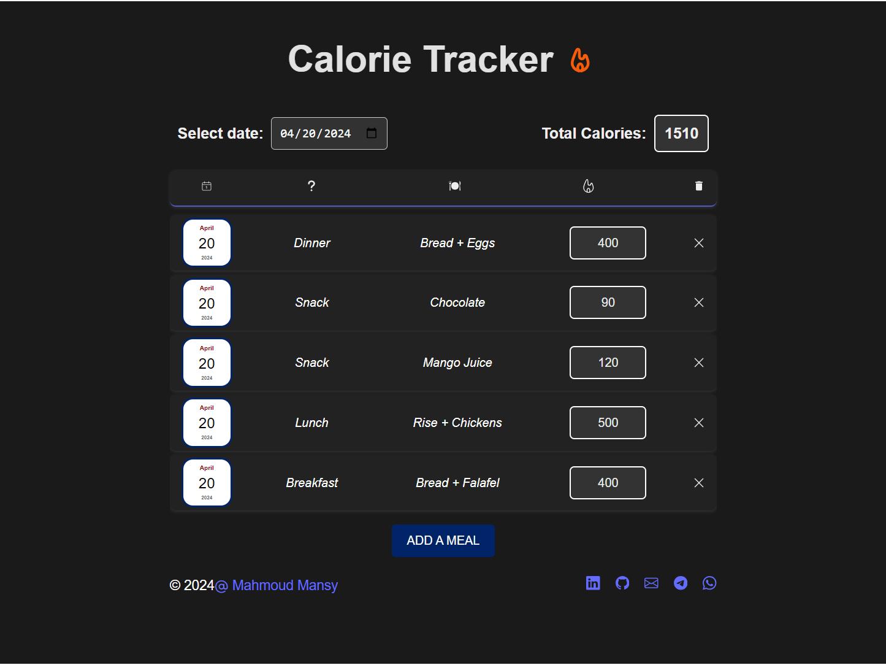
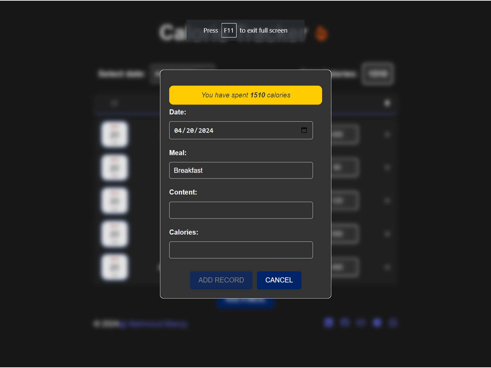
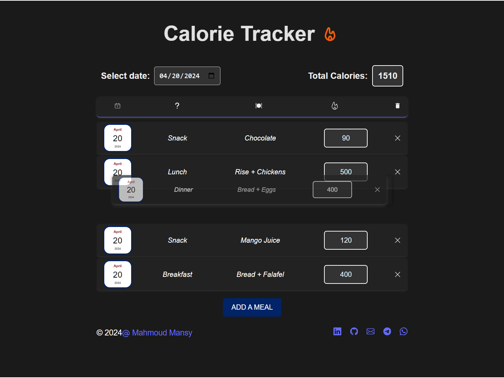
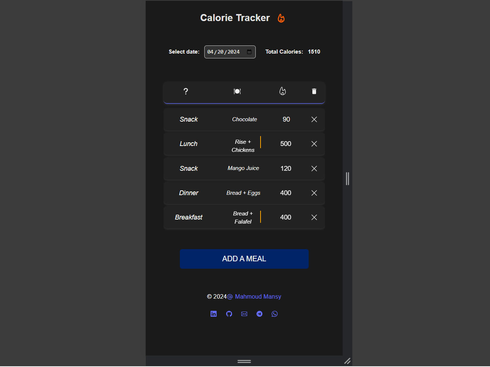
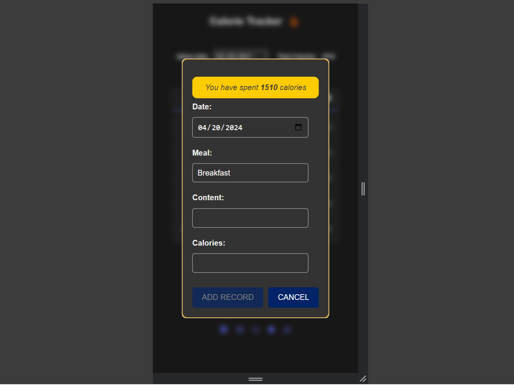

# Calorie Tracker 🔥

Calorie Tracker is a responsive web application built using React and Vite, providing users with an intuitive way to track their daily meals and calorie intake. With a focus on delivering the best user experience, Calorie Tracker leverages libraries like React Modal and Framer Motion to enhance interactivity and animation.


## [🌟Live Website🌟](https://calorie-tracker-sigma.vercel.app/)

## Features

- **Responsive Design**: Calorie Tracker is built with a mobile-first approach using React and Vite, ensuring seamless functionality across all devices, including smartphones, tablets, and desktops.
- **Intuitive Interface**: The user interface is designed to be intuitive and user-friendly, allowing users to easily navigate through the app, add, delete, and reorder meals with ease.
- **Meal Management**: Users can add meals to their daily records using a drag-and-drop form powered by React Modal and manage their calorie intake efficiently.
- **Dynamic Calendar**: The built-in calendar feature allows users to navigate to different days, view their meal records, and manage their calorie intake effortlessly.
- **Persistent Storage**: All data is securely stored locally in the browser's storage, ensuring that users can access their meal records even after closing the browser.

## Screenshots

### Disktop
  
<div style="display: flex; justify-content: center; flex-direction:row; ">
  
  
</div>

### Mobile
<div style="display: flex; justify-content: center; flex-direction:row ;">
  
  
</div>

## Getting Started

1. Clone the repository:

```bash
git clone https://github.com/MMansy/calorie-tracker.git
```

2. Navigate to the project directory:

```bash
cd calorie-tracker
```

3. Install dependencies:

```bash
npm install
```

4. Run the development server:

```bash
npm run dev
```

5. Open your web browser and navigate to `http://localhost:3000` to view the application.

## Usage

1. **Adding a Meal**: To add a meal, simply drag the meal form to the desired position on the screen, fill in the required information (meal name, content, and calories), and release the form. The meal will be added to your daily record.

2. **Deleting a Meal**: To delete a meal, click on the delete button next to the meal record. The meal will be removed from your daily record.

3. **Navigating Dates**: Use the calendar feature to navigate to different days and view your meal records for each day.


## Contact

- [Author](https://github.com/MMansy19)
- [Website](https://mahmoud-mansy-portfolio.netlify.app/)
- [Email](mailto:mahmoud2abdalfattah@gmail.com)
- [LinkedIn](https://www.linkedin.com/in/mahmoud-mansy-a189a5232)

